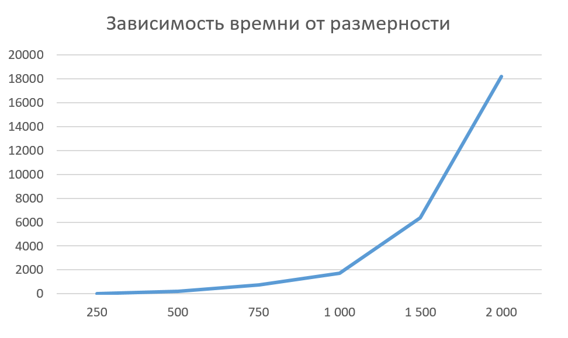

# Отчёт по лабораторной работе № 1

**Студент:** Кокшина Анна Александровна  
**Группа:** 6211-100503D  
**Вариант:** 10  
**Преподаватель:** Минаев Евгений Юрьевич  

---

## Задание
Написать программу на языке C/C++ для перемножения двух квадратных матриц.
Исходные данные: файл(ы) содержащие значения исходных матриц.
Выходные данные: файл со значениями результирующей матрицы, время выполнения, объем задачи.
Обязательна автоматизированная верификация результатов вычислений с помощью сторонних библиотек или стороннего ПО (например на Matlab/Python).

---

## Ход работы
Написали класс матрицы, добавили в него функции перемножения. Провели исследования зависимости времени умножения двух матриц от их размера (график представлен ниже). Была добавлена автоматическая проверка правильности результатов умножения с помощью python numpy.

  

---

## Вывод
В ходе работы была написана программа для перемножения двух матриц.