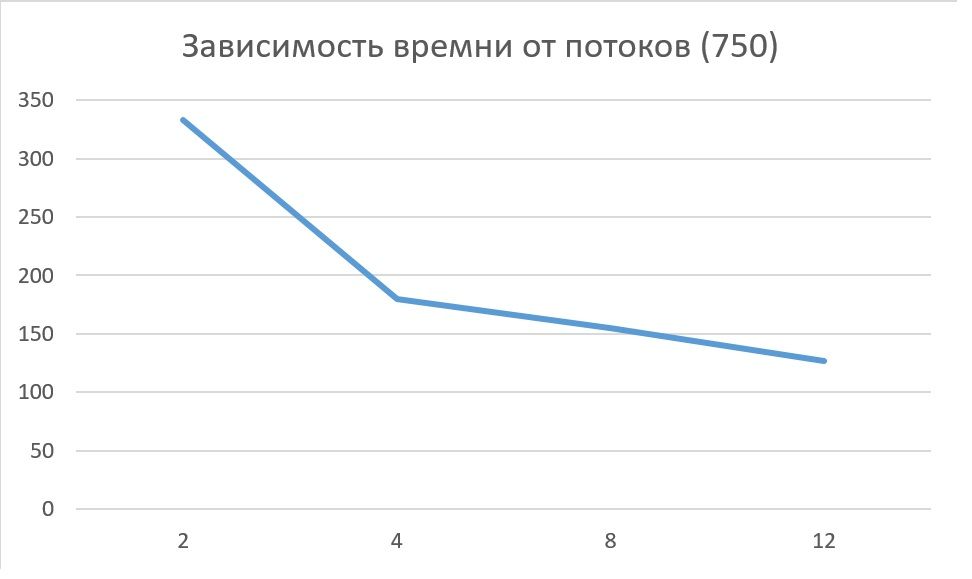
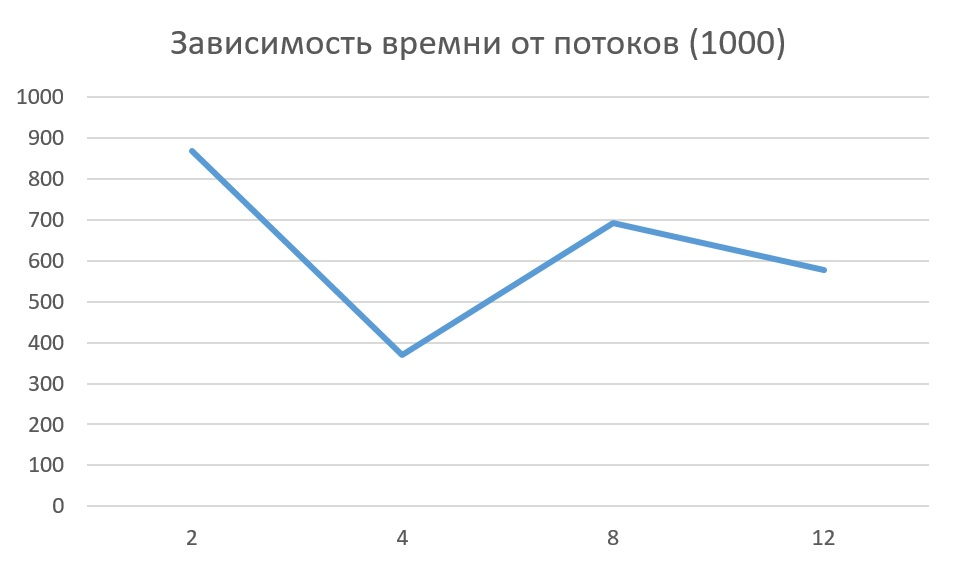
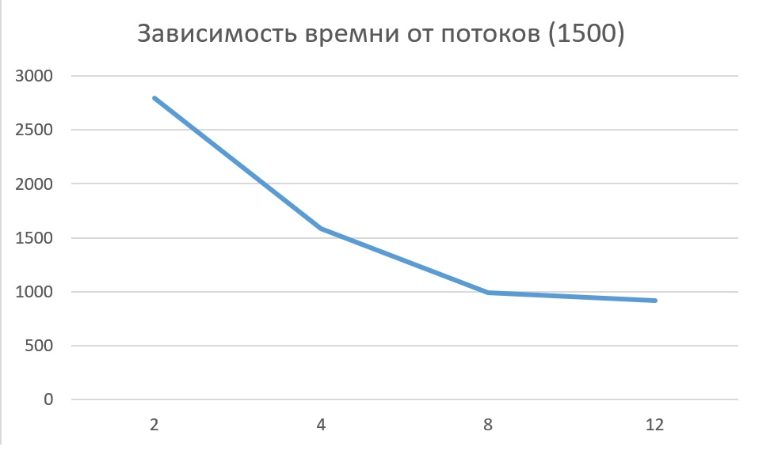
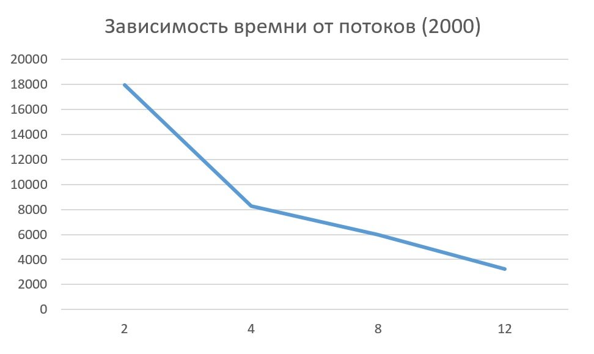
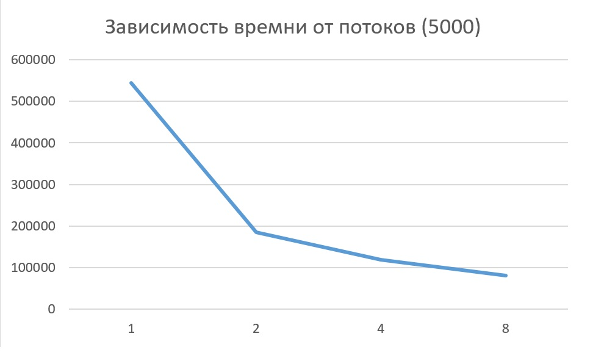

# Отчёт по лабораторной работе № 2

**Студент:** Кокшина Анна Александровна  
**Группа:** 6211-100503D  
**Вариант:** 10  
**Преподаватель:** Минаев Евгений Юрьевич  

---

## Задание
Модифицировать программу из л/р №1 для параллельной работы по технологии OpenMP.  Провести серию экспериментов с разным количеством потоков (1, 2, 4, 8 и т.д.), разными размерами матриц (примерно 200, 400, 800, 1200, 1600, 2000).

---

## Ход работы
Была переделана 1 лабораторная работа по методам OpenMP. Проведены исследования зависимости времени умножения двух матриц от количества потоков (графики представлены ниже).

 
 

 

---

## Вывод
В ходе работы была написана программа для параллельной работы по технологии OpenMP.