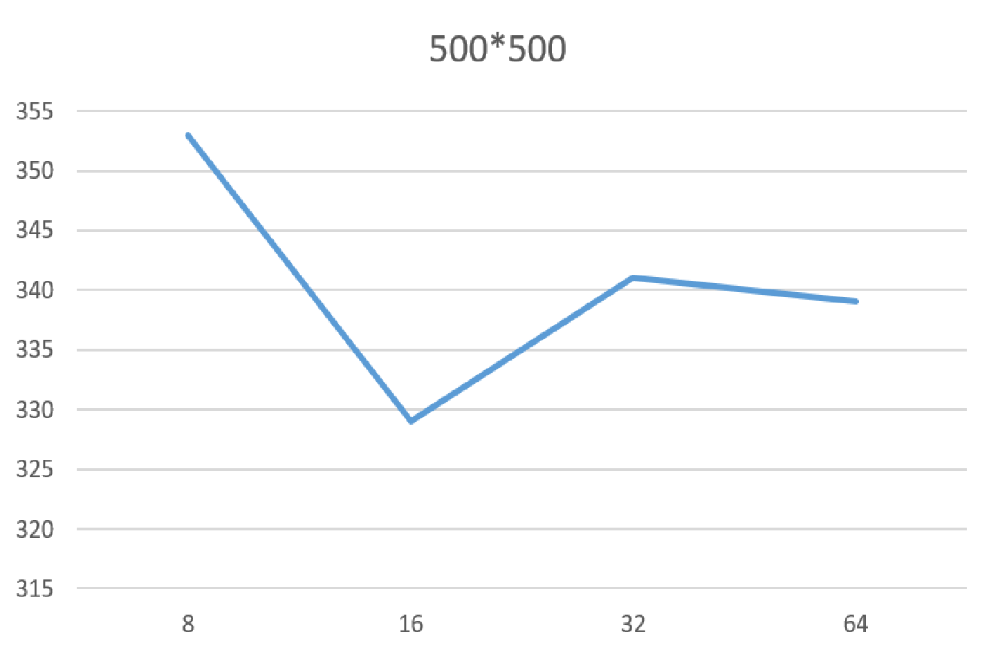
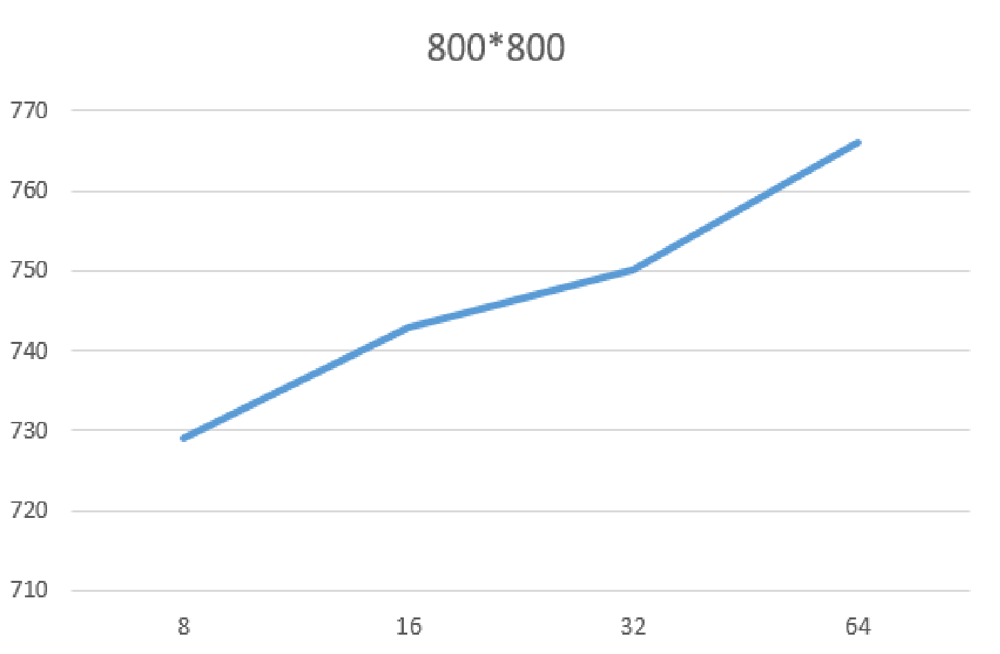
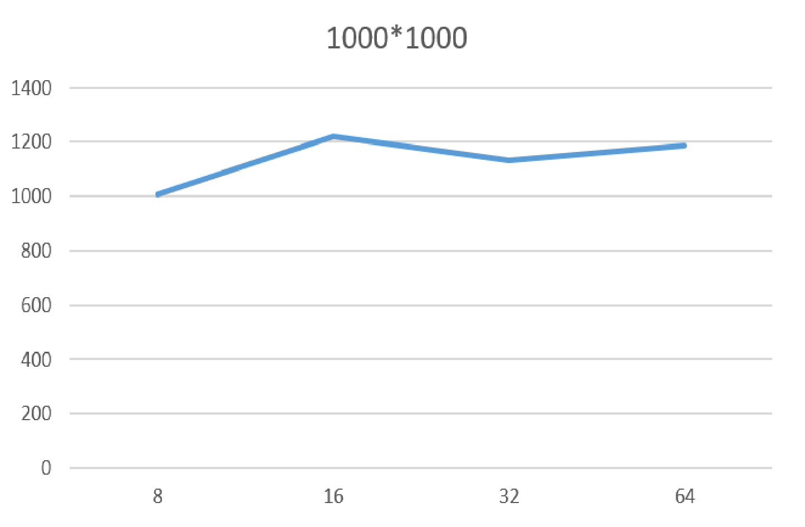
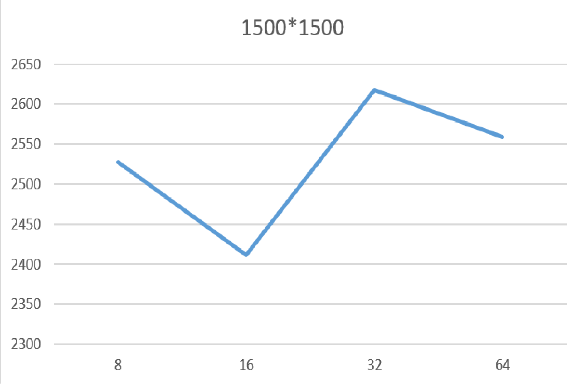
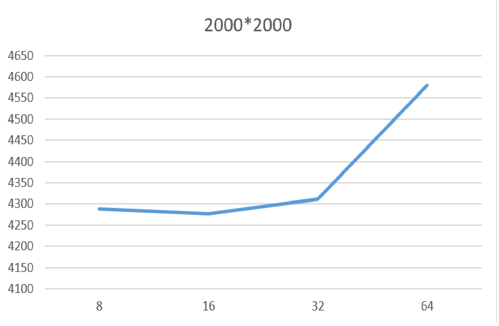

# Отчёт по лабораторной работе № 4

**Студент:** Кокшина Анна Александровна  
**Группа:** 6211-100503D  
**Вариант:** 10  
**Преподаватель:** Минаев Евгений Юрьевич  

---

## Задание
Модифицировать программу из л/р №1 для параллельной работы по технологии CUDA. Провести эксперименты с разными размерами матриц и различными конфигурациями сетки блоков.

---

## Ход работы
Была переделана 1 лабораторная работа по технологии CUDA. Проведены исследования зависимости времени умножения двух матриц от конфигурации блока(графики представлены ниже).

 
 

 

---

## Вывод
В ходе работы была написана программа для параллельной работы по технологии CUDA.